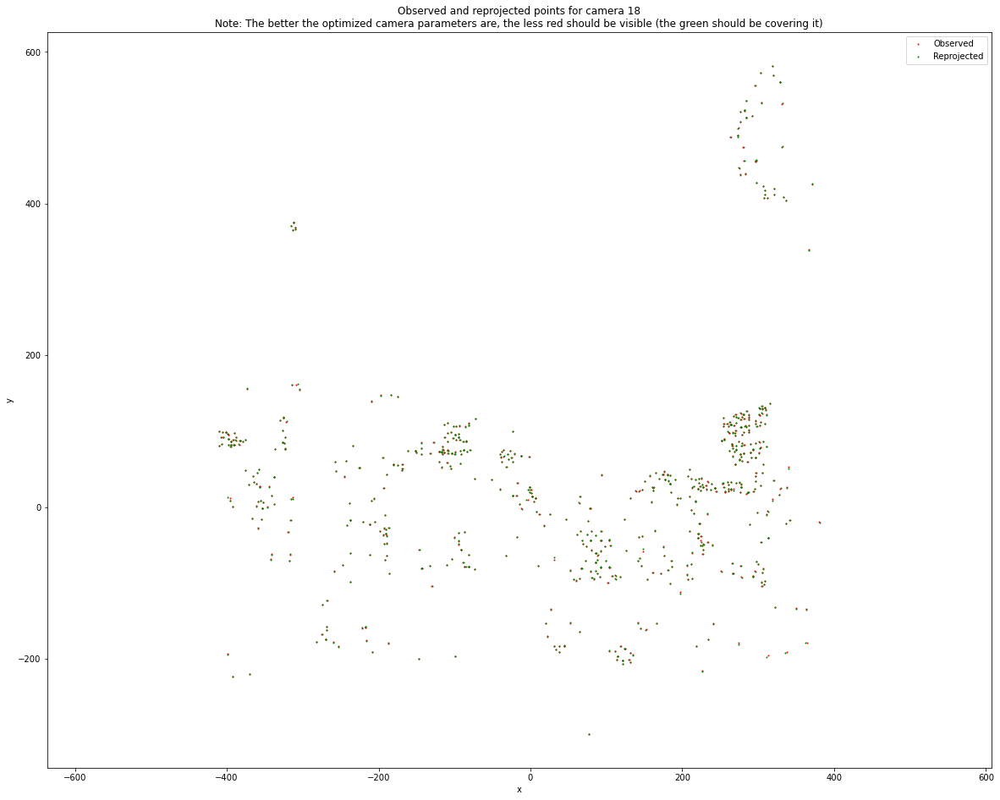

# Bundle Adjustment

**Bundle adjustment** is simultaneously solving for the locations of observed 3D points in a scene, the relative motion of the camera(s) in the scene, and the optical characteristics of those camera(s), all from a set of images capturing different viewpoints in the scene.

Based on [a bundle adjustment example in the SciPy documentation](https://scipy-cookbook.readthedocs.io/items/bundle_adjustment.html), this implementation will use data that the University of Washington GRAIL Lab has made publicly available at [http://grail.cs.washington.edu/projects/bal/](http://grail.cs.washington.edu/projects/bal/).

I'll use `scipy.optimize` in Python and `ceres` in C++ to solve a bundle adjustment problem and compare speed and accuracy of the optimizations. Just for fun :)

<!-- Maybe we will try using different camera models and compare the accuracy of those results as well. -->


### Background
Every camera has both intrinsic and extrinsic parameters. Camera **intrinsics** consist of geometric properties like lens focal lengths, principal centers, and distortion parameters. All cameras distort images, because it is impossible to perfectly align lenses and sensors in a manufacturing process. In this project, I'll use a three parameter camera model that describes camera intrinsics with one focal length `f`, and two distortion coefficients `k1` and `k2`. [This paper](https://arxiv.org/abs/1807.08957) has a good summary of a few different camera models that are commonly used.

Camera **extrinsics** describe the relative pose (position and orientation in 3D space) of each camera. These poses are relative to the world frame, and can change in relation to the other cameras, and to themselves at past timesteps if the cameras are moving. The poses are described with a translation vector `t = [x, y, z]` and a rotation vector `R = [r_1, r_2, r_3]` (using [Rodrigues' rotation formula](https://en.wikipedia.org/wiki/Rodrigues'_rotation_formula)).


### Python
After importing and organizing the data from the GRAIL lab, functions to rotate, translate, project, and distort the data points from each camera are defined. Next, a cost function is defined that takes the estimated locations of points in the 3D world, rotates, translates, projects, and distorts them with estimated camera parameters, and calculates the difference between the resulting location of the point in the camera frame with the observed point in the camera frame, also known as the **reprojection error**.

Finally, the sparsity of the system is exploited. The solver needs to find relationships in a very large matrix (`total number of observations` x `total number of camera parameters`), but only a few of these relationships matter. For example, the parameters for camera `n` are related to the observations from camera `n` and no other cameras. This sparsity can be defined using `lil_matrix` from `scipy.sparse`, and added into the evaluation via the `jac_sparsity` argument. Running the optimization using `least squares` converges in less than a minute.

For evaluation, the mean reprojection error can be calculated over each point observed by each camera. Typically a sub-pixel (< 1 pixel) reprojection error is considered "good".

Lastly, the observed points and the reprojected points from one camera can be plotted. The observed points are plotted first, in red, and the reprojected points on top of them, in green. If the optimized parameters are accurate, the reprojected points should be directly on top of the observed points and very little red should be visible. The more green, the better! An example image is below:


### C++
To run:
```
cd build
cmake ..
make
./bundle_adjustment
```